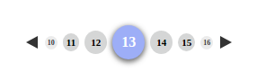

# @pluritech/pagination

This Angular Library can help you to implement an easy pagination. (Needs some server side)



## Installation

To install this library, run:

```bash
$ npm install @pluritech/pagination --save
```

## Importing the PaginationModule

Once you have installed the library with npm, you need now to import PaginationModule in your main application module:

and then from your Angular `AppModule`:

```typescript
import { BrowserModule } from '@angular/platform-browser';
import { NgModule } from '@angular/core';

import { AppComponent } from './app.component';


// Import pagination library
import { PaginationModule } from '@pluritech/pagination';

@NgModule({
  declarations: [
    AppComponent
  ],
  imports: [
    BrowserModule,
    // Specify the library in imports
    PaginationModule
  ],
  providers: [],
  bootstrap: [AppComponent]
})
export class AppModule { }
```

Once the library is imported, you can use the pagination component like the following:

```xml
<pluritech-pagination 
  [total]="500" 
  [limit]="9"
  (changePage)="handleChangePage($event)">
</pluritech-pagination>
```

## How it works?

The pagination component has some events. You can click directly in a page, or, you can click in one of the arrow-buttons (right/left), when you do it an event will be emitted with the following data (JavaScript object):

Key | Value
--- | -----
limit | The limit of records in each page 
nPage | The number of the current page
offset | The number of records that should be skipped in the next server side query
total | The total of records

You can also change the pages pressing the mouse on the arrow-buttons, in this case, the event will be emitted only when the mouse leaves the button or on the mouseup event.

## Credits
[Generator Angular 2 Library](https://github.com/jvandemo/generator-angular2-library)


## License

MIT © [Lucas C. Correa &amp;&amp; Mateus Duraes](mailto:lucas@pluritech.com.br)
